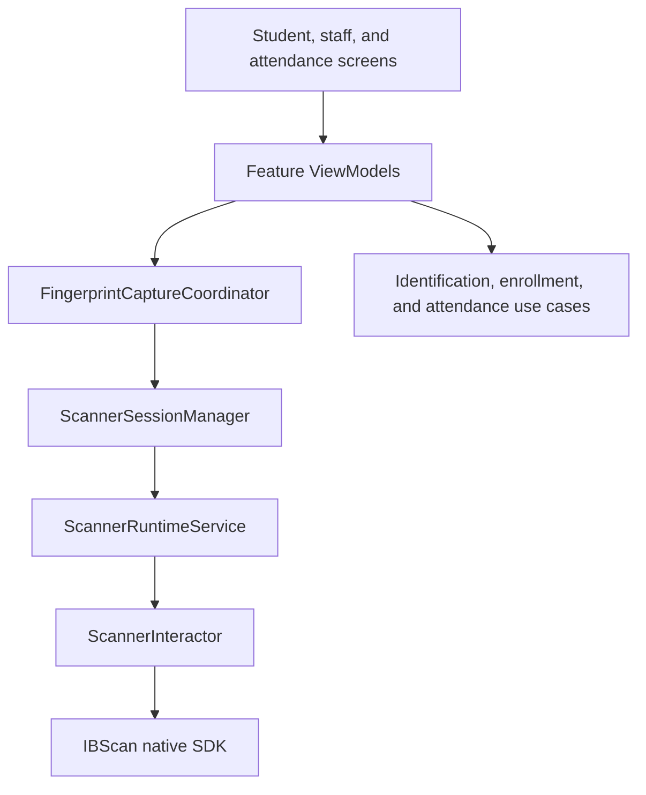
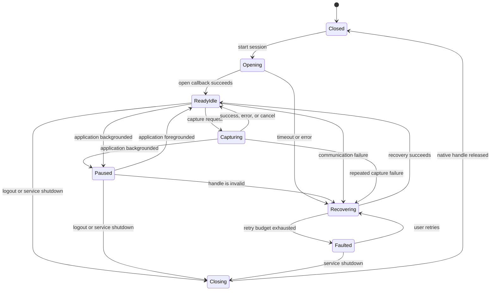
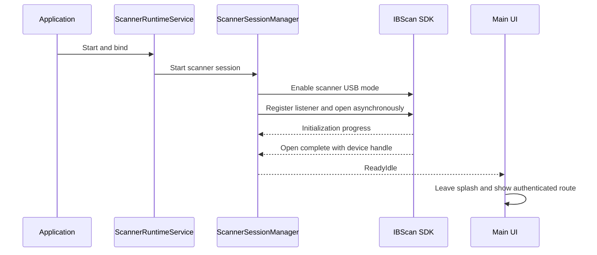
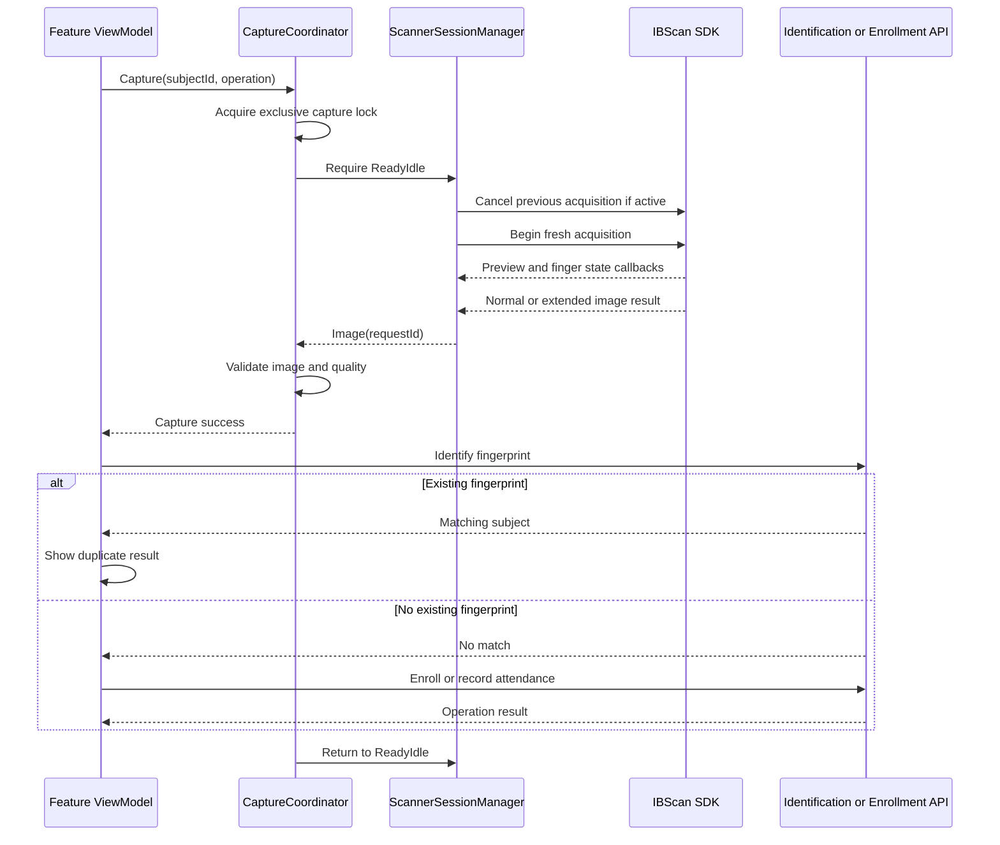

# Fingerprint Capture Session Flow

## Status

Proposed architecture for implementation after student and staff attendance are complete.

## Purpose

This document defines how fingerprint capture should be shared by:

- Student biometric enrollment
- Staff biometric enrollment
- Student attendance
- Staff attendance

The objective is to keep the scanner reliable across delayed use, batch capture,
backgrounding, long idle periods, USB interruptions, process recreation, and
network or authentication failures.

## Device Observation

Testing on the target scanner showed that repeatedly closing and reopening the
native scanner is an unreliable boundary:

- The scanner closed successfully when the application moved to the background.
- The SDK later reported that the device had reopened.
- The reopened device produced preview frames.
- It did not produce platen, finger-quality, finger-count, or completed-image
  callbacks when a finger was placed on the scanner.

An SDK open callback and preview frames therefore do not prove that a scanner is
fully capable of completing a fingerprint acquisition.

The implementation should minimize native close/open cycles and use one shared,
process-level scanner owner.

## Primary Rule

> Preserve the scanner session and the application workflow, but never preserve
> an in-progress fingerprint acquisition.

When the application is backgrounded, any active acquisition is cancelled. The
open scanner handle, current subject, navigation destination, and workflow step
may be retained. A fresh acquisition starts when the user returns.

## Recommended Architecture



### ScannerRuntimeService

The Android foreground service is the sole owner of `IBScan` and
`IBScanDevice`.

Responsibilities:

- Open the scanner once for the active application session.
- Retain the native handle while the UI is backgrounded.
- Release the scanner at an explicit, controlled shutdown boundary.
- Keep the process eligible to retain the scanner during extended background
  use.
- Publish device attachment and communication failures.

The service should not own student, staff, enrollment, or attendance business
logic.

### ScannerSessionManager

The application-scoped manager exposes scanner state and serializes lifecycle
operations.

Responsibilities:

- Start, pause, resume, recover, and stop the scanner session.
- Serialize native operations with a `Mutex`.
- Cache a device ID and index only while their native handle is valid.
- Assign a generation ID to each open session.
- Ignore callbacks belonging to an older generation.
- Apply bounded timeout and recovery policies.

### FingerprintCaptureCoordinator

The coordinator is the single entry point for all fingerprint acquisition.

Responsibilities:

- Permit only one active capture request.
- Cancel an old acquisition before beginning a new one.
- Associate callbacks with a capture request ID.
- Apply capture timeouts.
- Validate the returned image before giving it to a feature ViewModel.
- Return the scanner to an idle-ready state after every result.

### Feature ViewModels

Student enrollment, staff enrollment, student attendance, and staff attendance
retain separate ViewModels and business rules. They submit capture requests to
the shared coordinator.

Feature ViewModels are responsible for:

- Subject lookup and validation
- Identification
- Enrollment
- Attendance recording
- Authentication and network errors
- Feature-specific navigation and messages

Feature ViewModels must not open or close the native scanner.

## Scanner State Machine



Suggested states:

```text
Closed
Opening(progress)
ReadyIdle(deviceId, deviceIndex, generation)
Capturing(requestId, generation)
Paused(deviceId, deviceIndex, generation)
Recovering(attempt, reason)
Faulted(reason)
Closing
```

`ReadyIdle` means that the native handle is open and available. It must not be
emitted from a cached device ID after the handle has been closed.

## Cold Start Flow



The initial splash may wait for scanner readiness. After initial navigation has
started, scanner state changes must not destroy or replace the main navigation
host.

## Capture Flow



Both `deviceImageResultAvailable` and
`deviceImageResultExtendedAvailable` must be handled. An image should be rejected
when it is empty, has invalid dimensions, is below the approved quality
threshold, or belongs to a stale request.

## Background and Resume Flow

When Home is pressed or another application is opened:

1. Notify the capture coordinator that the UI is backgrounded.
2. Cancel an active acquisition.
3. Discard any fingerprint image that has not completed its business operation.
4. Retain the open scanner handle in the runtime service.
5. Preserve non-sensitive workflow state such as subject ID, subject type,
   operation type, and current destination.
6. Move the session to `Paused`.

When the application returns:

1. Rebind the UI to the existing runtime service.
2. Confirm that the USB device is still attached and no communication-broken
   callback has invalidated the handle.
3. Move from `Paused` to `ReadyIdle` without reopening a healthy scanner.
4. Restore the same application destination.
5. If the user was on a fingerprint screen, begin a fresh acquisition.

The user resumes the workflow, not the previous native acquisition.

## Scenario Policy

| Scenario | Expected behavior |
| --- | --- |
| User logs in and waits until later | Keep the scanner open in `ReadyIdle`; do not run an acquisition. |
| Many students and staff are captured | Reuse one handle and process requests sequentially. Never reopen per subject. |
| User switches to another application | Cancel acquisition, keep the handle, preserve workflow, and start a fresh acquisition on return. |
| Device is left for a long time | Foreground service retains an idle handle. If the process is killed, use the cold-start recovery path. |
| USB scanner is detached | Cancel capture, invalidate cached identifiers, show unavailable state, and wait for attachment. |
| USB scanner is reattached | Wait for enumeration and permission before one controlled asynchronous open. |
| Scanner streams previews but never completes | Time out acquisition, soft-retry once, then perform bounded hard recovery. |
| User double-taps capture | The coordinator accepts one request and rejects or coalesces the duplicate. |
| User changes subject during capture | Cancel the old request and create a new request ID before beginning another acquisition. |
| Authentication expires | Cancel capture, discard the image, refresh authentication, or return to login. |
| Network fails after capture | Do not persist the raw image by default. Show retry according to the approved security policy. |
| User logs out | Cancel acquisition, clear workflow state, close the scanner, and disable scanner USB mode. |
| Application is updated or process is killed | Treat the next launch as a cold start; never trust cached native readiness. |

## Batch Capture Rules

For capturing multiple students or staff:

1. Keep the scanner in one session.
2. Allow only one subject and one operation to own capture at a time.
3. Clear the previous image and request ID after every result.
4. Return to `ReadyIdle` before moving to the next subject.
5. Keep successful and failed business results separate from scanner state.
6. A failed API request must not cause the scanner to reopen.
7. A failed scanner request must not silently enroll or mark attendance.

## Recovery Policy

Recovery must be bounded and observable.

### Soft Recovery

Use when the native handle still appears valid:

1. Cancel the active acquisition.
2. Clear capture callbacks and request state.
3. Wait for the configured cancellation delay.
4. Begin a fresh acquisition.

### Hard Recovery

Use after repeated acquisition failure or communication loss:

1. Block new capture requests.
2. Invalidate the current generation.
3. Remove device and SDK listeners.
4. Cancel acquisition and close the native handle.
5. Disable scanner USB mode.
6. Wait for the tested hardware reset interval.
7. Enable scanner USB mode.
8. Wait for USB enumeration and permission.
9. Register listeners and call `openDeviceAsync` once.
10. Accept readiness only from the new generation's open callback.

Use a limited retry budget, such as one soft retry followed by two hard recovery
attempts. After the budget is exhausted, enter `Faulted` and require an explicit
Retry action. Do not create an endless restart loop.

## Timeouts

Timeout values must be confirmed through hardware testing. The implementation
should define separate limits for:

- USB enumeration
- Native device initialization
- First preview frame
- Finger placement
- Completed image callback
- Capture cancellation
- Identification API
- Enrollment or attendance API

A timeout must identify its phase. Avoid reporting every timeout as "scanner not
found."

## Navigation and UI Rules

- Scanner state controls scanner overlays and controls, not the root route.
- Keep the main navigation host mounted after cold-start readiness.
- Show a blocking recovery overlay over the current screen when recovery is in
  progress.
- Disable capture commands while another request is active.
- Display actionable states such as place finger, improve finger quality,
  processing, retry, and scanner unavailable.
- Restore the same subject and destination after foregrounding.
- Never show capture success until a validated image callback is received.

## Security and Data Retention

- Do not persist raw fingerprint images by default.
- Discard incomplete or unsubmitted images when backgrounding, logging out, or
  changing subjects.
- Persist only non-sensitive workflow metadata needed to restore navigation.
- If offline biometric storage becomes a requirement, define encryption, key
  management, retention, deletion, and audit requirements before implementation.
- Ensure a captured image cannot be submitted under a different subject or
  capture request ID.

## Observability

Production diagnostics should record:

- Session generation and capture request ID
- Scanner state transitions
- USB attach, detach, and permission events
- Open, close, cancel, and capture durations
- Finger, quality, platen, warning, and result callbacks
- Soft and hard recovery attempts
- Native SDK exception type
- Identification and enrollment outcome without biometric image data

Logs must not contain raw fingerprint bytes, authentication tokens, or sensitive
subject profile data.

## Implementation Plan

### Phase 1: Shared Runtime

- [ ] Move native scanner ownership out of `MainActivity`.
- [ ] Add `ScannerRuntimeService`.
- [ ] Keep `ScannerSessionManager` application-scoped.
- [ ] Add the complete scanner state machine.
- [ ] Serialize scanner operations with a `Mutex`.
- [ ] Add session generation IDs and ignore stale callbacks.

### Phase 2: Capture Coordinator

- [ ] Add an explicit cancel-capture operation through device, data, domain, and
  UI layers.
- [ ] Add `FingerprintCaptureCoordinator` with one active request.
- [ ] Replace `captureImageManually()` behavior for an already-active capture
  with cancel-then-begin-fresh behavior.
- [ ] Handle both normal and extended result callbacks.
- [ ] Add image validation and capture-phase timeouts.

### Phase 3: Lifecycle and Navigation

- [ ] On background, pause the workflow and cancel acquisition without closing
  the device.
- [ ] On foreground, restore the route and start a fresh acquisition when needed.
- [ ] Decouple root navigation from transient scanner state.
- [ ] Add a scanner recovery overlay.
- [ ] Persist non-sensitive workflow metadata with saved state.

### Phase 4: Feature Integration

- [ ] Integrate student enrollment with the coordinator.
- [ ] Integrate staff enrollment with the coordinator.
- [ ] Integrate student attendance with the coordinator.
- [ ] Integrate staff attendance with the coordinator.
- [ ] Ensure all four features share one capture lock and recovery policy.

### Phase 5: Reliability Testing

- [ ] Cold install, login, scanner initialization, and first capture.
- [ ] Delayed first capture after several hours idle.
- [ ] At least 100 sequential captures without reopening the scanner.
- [ ] Background and foreground during idle.
- [ ] Background and foreground during active acquisition.
- [ ] Long background period and return.
- [ ] Process kill and cold restoration.
- [ ] USB detach and reattach during idle and capture.
- [ ] Network and authentication failure after image capture.
- [ ] Repeated low-quality and no-finger timeouts.
- [ ] Logout and login with a new scanner session.
- [ ] Device reboot and application restart.

## Acceptance Criteria

The architecture is complete when:

- Student and staff enrollment and attendance use the same capture coordinator.
- The scanner does not reopen between subjects or ordinary screen navigation.
- Pressing Home cancels acquisition but does not destroy a healthy scanner
  session.
- Returning to the app restores the same workflow and starts a fresh acquisition.
- Process death results in a safe cold start rather than stale readiness.
- Native callbacks from an old session or request cannot update the current UI.
- Every timeout and recovery attempt is bounded and visible.
- Raw fingerprint data is not persisted or written to logs.

