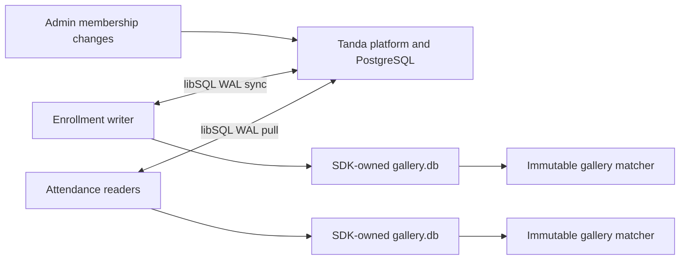
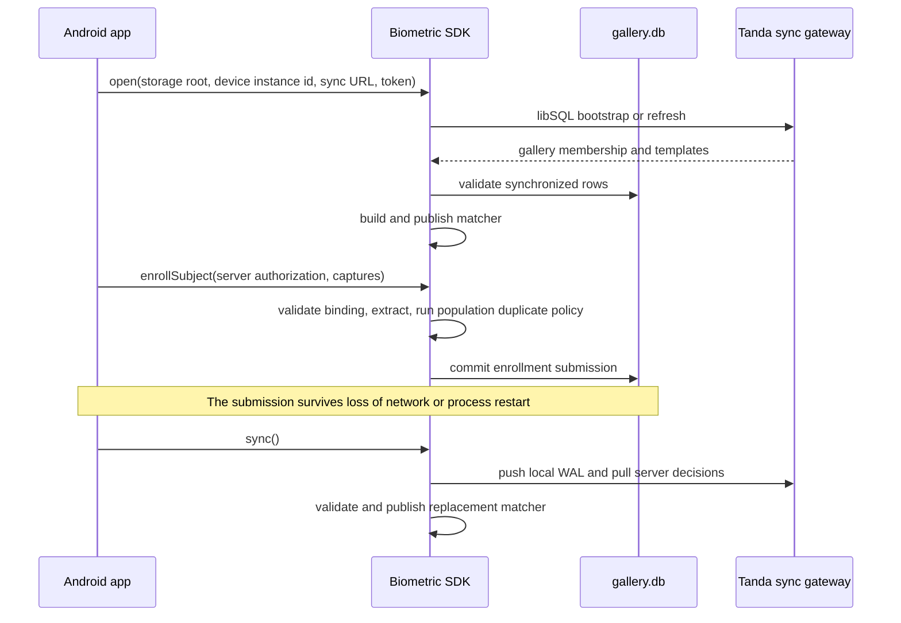

# Biometric SDK

Pure Rust fingerprint enrollment and offline 1:N identification for Tanda
attendance devices. The SDK owns a synchronized fixed-population libSQL
gallery, exposes a
small Kotlin API through UniFFI, and provides the same artifact validator to the
Go server through a panic-contained C ABI.

Raw fingerprint images are used only during extraction. They are not stored in
libSQL, PostgreSQL, template artifacts, or the in-memory matcher. Extracted
templates remain sensitive biometric data and require encrypted device storage,
TLS, scoped credentials, and restricted server access.

## Gallery Model

One gallery represents one fixed population. Every physical device instance
assigned to that gallery receives the same active membership and canonical
templates. One switchable enrollment writer may also create locally durable,
online-authorized enrollment submissions; reader devices only pull.



The Android application supplies only provisioning and commands. It does not
open SQLite, execute SQL, move WAL frames, decode template payloads, or manage
gallery files.

## Responsibilities

The SDK:

- validates `400x500` grayscale fingerprint captures;
- extracts quality-scored minutiae and invariant descriptors;
- persists one SDK-owned `gallery.db` replica;
- pushes and pulls through the official libSQL sync client;
- keeps an authorized enrollment submission durable if connectivity drops;
- enforces one active, resumable group-enrollment batch per writer;
- performs local duplicate checks against the current population;
- rebuilds and atomically publishes an immutable 1:N matcher;
- returns atomic match evidence or a stable `Retry` reason;
- validates opaque one-subject artifacts on the Go server.

The application platform remains authoritative for gallery membership, writer
assignment, administrator authorization, site-wide duplicate checks,
canonical template revisions, and enrollment decisions.

## Device Flow



Identification never waits for network or database I/O. It reads the latest
published matcher through `ArcSwap`; a failed sync or invalid replacement leaves
the previous verified matcher available.

## Rust API

Enable `attendance-libsql` when embedding the attendance facade without Kotlin:

```rust
use biometric_sdk::sdk::{
    AttendanceBiometricSdk, AttendanceConfig, AttendanceIdentifyResult,
    AttendanceProvisioning,
};

let provisioning = AttendanceProvisioning::new(
    "device-instance-42",
    "https://attendance.example/v1/libsql/gallery",
    device_token,
);
let sdk = AttendanceBiometricSdk::open(AttendanceConfig::new(
    "/app/files/biometric",
    provisioning,
))?;

match sdk.identify_raw_bytes(&capture)? {
    AttendanceIdentifyResult::Match(evidence) => record_clock_event(evidence),
    AttendanceIdentifyResult::Retry(retry) => request_another_scan(retry.reason),
}
```

The first synchronized open requires connectivity. Later opens may use an
existing verified replica in `Offline` state. Network access occurs only during
`open`, `sync`, and `rotate_auth_token`.

Enrollment must be authorized online by the application platform. Once capture
begins, its transaction is locally durable through a connection loss:

```rust
let authorization = authorize_subject_enrollment_online()?;
let result = sdk.enroll_subject(
    authorization,
    [&left_thumb[..], &right_thumb[..]],
)?;

if result.submission_id.is_some() {
    schedule_sync();
}
```

Submission and batch identifiers are UUIDv7 values generated inside the SDK.
Pending captures are provisionally searchable only on the writer that created
them. A later server decision either replaces the provisional template with its
canonical revision or removes it.

## Matcher

The identification path has two stages:

```text
raw capture
  -> quality and minutiae extraction
  -> invariant descriptor candidate lookup
  -> geometric minutiae verification
  -> best template per subject
  -> Match or Retry
```

Default clock-in policy:

| Check | Default |
| --- | ---: |
| Query quality | `40` |
| Blended score | `0.30` |
| Geometric verification | `0.20` |
| Best-vs-runner-up margin | `0.02` |
| Enrollment quality | `65` |

See [matcher algorithm](docs/matcher-algorithm.md),
[performance](docs/performance.md), and
[SourceAFIS comparison](docs/sourceafis-comparison.md) for implementation and
measurement details. The current corpus is an engineering benchmark, not a
production FAR/FRR certification.

## Artifact Contract

The synchronized tables and PostgreSQL store carry one opaque template artifact
per subject and modality:

| Field | Meaning |
| --- | --- |
| `subject_id` | Expected owner of every encoded record |
| `sdk_format_version` | Binary format contract |
| `extractor_profile` | Extraction and matching profile |
| `template_payload` | Bounded SDK-owned bytes |
| `payload_sha256` | `sha256:<lowercase hex>` integrity digest |

The artifact contains extracted templates only. It has no membership, gallery,
database, synchronization cursor, raw capture, or derived search index. Go and
Kotlin treat the payload as opaque.

## Kotlin And Android

The `uniffi-bindings` feature embeds a `MobileBiometricSdk` API in the native
library using UniFFI proc-macro metadata. It exposes provisioning, explicit
sync, offline identification, single enrollment, group enrollment, pending
counts, and credential rotation. The mobile team's UniFFI toolchain generates
Kotlin from that metadata; generated Kotlin is intentionally not checked into
this repository.

Run `make uniffi-lib` for a host library suitable for binding generation and
`make android-libs` for the ABI-specific Android libraries. The generation
contract, lifecycle, and Android integration details are in the
[Kotlin integration guide](bindings/kotlin/README.md).

## Server Validator

The `server-ffi` feature builds a small shared library without libSQL or UniFFI:

```bash
make server-lib
make install-server-lib DESTDIR=/tmp/biometric-sdk-package PREFIX=/usr/local
```

The package contains `libbiometric_sdk.so`, `biometric_sdk.h`, and
`biometric-sdk.pc`. Tanda Campus links it with the Go build tag
`biometric_rust`. See [server FFI](docs/server-ffi.md).

## Development

Rust `1.88` is the minimum supported version.

```bash
cargo fmt --all --check
cargo test --locked
cargo test --locked --no-default-features --features server-ffi
cargo clippy --locked --all-targets --all-features -- -D warnings
RUSTDOCFLAGS="-D warnings" cargo doc --locked --no-deps --document-private-items --all-features
```

Architecture, schema, synchronization states, and failure handling are covered
in [SDK architecture](docs/sdk-architecture.md) and
[attendance libSQL integration](docs/attendance-libsql.md).

The coordinated changes required for the generic fixed-population attendance
model are tracked in the
[Tanda attendance support plan](docs/tanda-attendance-support-plan.md).
