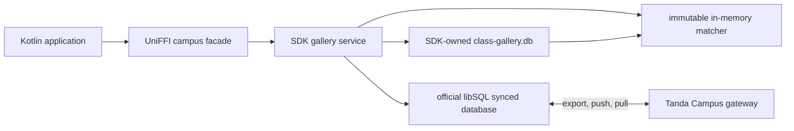

# Campus libSQL Integration

## Scope

The campus integration makes the SDK the sole owner of the local biometric
gallery database. A mobile application provides a sync URL and device
credential, then uses enrollment and identification methods without accessing
SQLite or the libSQL protocol.

The synchronized database is the only durable gallery representation. A
versioned one-student template artifact lets extracted templates cross the
device/server boundary without exposing matcher internals or raw captures.

## Runtime Boundary

The SDK serializes database mutation and synchronization. Extraction and index
construction happen outside the database transaction. A completed index is
published atomically so clock-in matching does not wait for network I/O.

## State Model

The database distinguishes three forms of durable state:

1. Canonical roster and template rows projected by the server.
2. Pending enrollment submissions committed by the active writer.
3. Immutable server decisions projected back to the originating gallery.

The matcher is an in-memory derivative, not another persisted representation.
It is rebuilt from validated current rows after open and successful sync.

Pending submissions may be included provisionally only on the writer that
captured them. An accepted result causes the canonical row to replace the
provisional entry. A rejected result removes it. Readers never infer acceptance
from a submission row.

The application-level `gallery_revision` is not a libSQL checkpoint generation
or WAL frame number. It identifies the canonical class state used for matching
and is recorded with biometric attendance evidence.

## Provisioning And Recovery

A new synchronized instance must bootstrap successfully before its first
offline operation. Later starts may continue with a verified local replica when
the network is unavailable. The SDK rejects an unsupported schema before
decoding biometric payloads.

Writer-forbidden is an authority change, not a transient network failure. The
SDK enters `WriterRevoked`, blocks further enrollment, and keeps the previous
verified matcher available. `Quarantined` is reserved for synchronized rows
that fail schema or artifact validation. Corrupt or stale read-only replicas can
be discarded and bootstrapped again because PostgreSQL and the gateway remain
canonical.

The gateway accepts the physical WAL generated by libSQL. Device-local salts
and cumulative checksums are validated before the server normalizes each frame
into its canonical stream checksum chain. Readers receive canonical frames;
libSQL re-encodes those frames into each replica's local WAL representation.

## Security Boundary

Raw fingerprint images never enter libSQL. Candidate and canonical template
artifacts are length-bounded and checksum-verified before decode. Production
provisioning must use HTTPS, scoped expiring credentials, and encrypted
application storage. Logs may contain approved identifiers and state
transitions but never template payloads, raw captures, credentials, or
identity-linked match scores.
