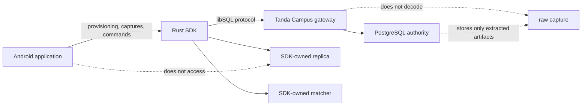
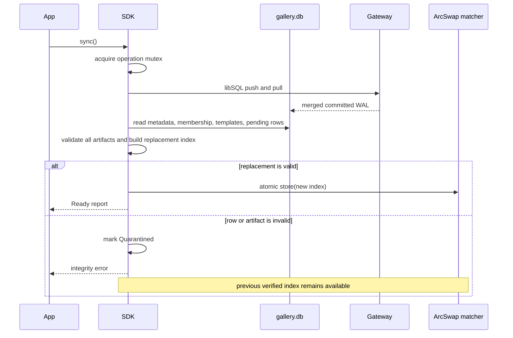
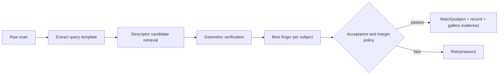

# SDK Architecture

## Purpose

The biometric SDK is the device-side owner of fingerprint extraction, local
fixed-population gallery persistence, libSQL synchronization, and offline 1:N
matching.
The surrounding Android application passes provisioning and user actions. It
does not own a gallery schema or biometric persistence implementation.

The architecture is designed around five constraints:

1. Clock-in must continue without a network connection.
2. A device should search only the subjects assigned to its gallery.
3. An online-authorized enrollment must survive process death and delayed synchronization.
4. The server must enforce membership authority and population-wide uniqueness.
5. Matching must not block on SQL, synchronization, or index construction.

## Codebase Map

| Module | Responsibility |
| --- | --- |
| `fingerprint.rs` | Validate and orient a `400x500` grayscale capture |
| `sdk/extractor.rs` | Build quality-scored minutiae and invariant descriptors |
| `sdk/index.rs` | Candidate retrieval, geometric verification, identity policy |
| `sdk/template.rs` | Encode and decode bounded extracted-template artifacts |
| `sdk/artifact.rs` | Verify metadata, checksum, ownership, and duplicates |
| `sdk/gallery.rs` | Pair validated template state with a derived search index |
| `sdk/enrollment.rs` | Define capture acceptance and rejection contracts |
| `sdk/attendance.rs` | Own the replica, synchronization, authorization records, batches, and publication |
| `kotlin.rs` | Expose the attendance workflow to Android through UniFFI |
| `server_ffi.rs` | Reuse artifact validation from the Go server |

## Ownership Boundaries

The application owns UI state, sensor acquisition, provisioning delivery, and
clock-event creation. The SDK owns all biometric bytes after a capture is
submitted. The application platform owns gallery membership, writer authority,
administrator authorization, canonical template revisions, and enrollment
decisions.

Raw captures are discarded after extraction. The durable payload is a
one-subject `TemplateStore` containing extracted features only. Neither Go nor
Kotlin interprets that binary representation.

## Gallery Schema

The synchronized database uses schema identifier `tanda-gallery` and schema
version `3`.

| Table | Direction | Purpose |
| --- | --- | --- |
| `sync_metadata` | Server to device | Schema, stream, gallery, and domain revision |
| `gallery_members` | Server to device | Effective subject membership and profile revision |
| `gallery_templates` | Server to device | Canonical template per subject and modality |
| `enrollment_batches` | Writer to server | Authorized, attributable group organizer lifecycle |
| `enrollment_submissions` | Writer to server | Authorized subject candidate and capture metadata |
| `enrollment_results` | Server to device | Immutable accepted or rejected decision |

The database deliberately stores current projection rows. Domain ordering is
represented by `gallery_revision`; physical replication ordering is represented
by libSQL WAL frames. These values are independent and must never be converted
into one another.

An enrollment submission records its physical device instance, canonical
subject, operation authorization, administrator attribution, authorization
expiry, and gallery revision observed by the device. This is evidence for audit
and conflict analysis, not permission for the device to assign a canonical
revision.

## Initialization

`AttendanceBiometricSdk::open` performs the following sequence:

1. Validate device-instance ID, endpoint, credential, extraction policy, and limits.
2. Create the SDK storage directory.
3. Acquire an exclusive file lease and verify the storage root's persisted
   physical device-instance binding.
4. Create a two-worker Tokio runtime owned by the SDK.
5. Open libSQL's synced database with remote SQL writes disabled.
6. Attempt an initial synchronization.
7. Validate schema metadata and every active template artifact.
8. Build an immutable `GalleryIndex`.
9. Publish the verified index and return the facade.

A new replica cannot be used until step 6 succeeds. An existing replica may
open in `Offline` state after a transient sync failure, but it still has to pass
local schema and artifact validation. This prevents an empty or corrupt first
install from appearing usable.

Only one SDK process may own a replica directory. The file lease fails fast
instead of allowing two local libSQL clients to write the same file.
The same storage root cannot later be opened as another physical instance.

## Synchronization Algorithm

Synchronization is explicit. The SDK does not run a hidden network loop.

The operation mutex serializes `sync`, credential rotation, enrollment writes,
and group-batch changes. This gives each operation a stable database view and
prevents a sync from racing a local transaction. Identification does not use
that mutex.

The rebuilt matcher is staged completely before publication. Validation or
allocation failure cannot partially mutate the live generation.

## Offline Identification

`identify_raw_bytes` loads the current `Arc<GalleryIndex>` from `ArcSwap`, then
extracts and searches without touching the database. Existing identify calls
retain their `Arc` while a newly synchronized matcher is published.

The matcher never selects a subject solely because one candidate ranked first.
Low quality, no shared descriptors, weak verification, or an ambiguous top-two
margin produces `Retry`.

An accepted result includes `subject_id`, `record_id`, `gallery_id`,
`gallery_revision`, `modality=fingerprint`, `score`, and
`verification_score`. Gallery identity and revision come from the same
immutable `Arc<GalleryIndex>` generation that produced the match.

## Enrollment Algorithm

Single and group enrollment use the same durable submission path. A group batch
is an online-authorized organizer; it does not grant blanket capture authority
or change artifact semantics. Every subject requires a separate server-issued
authorization.

For one subject, the SDK:

1. Validates authorization expiry and its device-instance, gallery, subject,
   optional batch, and administrator bindings.
2. Requires current active gallery membership in the local projection.
3. Rejects a locally reused enrollment operation ID.
4. Extracts every supplied capture and assigns a UUIDv7 finger-record ID.
5. Rejects invalid, low-quality, or excess captures individually.
6. Searches accepted captures against other subjects in the current population.
7. Rolls back all accepted captures if any cross-subject duplicate is found.
8. Encodes accepted captures as one bounded one-subject artifact.
9. Computes the canonical `sha256:<hex>` payload checksum.
10. Commits attribution and the UUIDv7 submission row in one immediate transaction.
11. Rebuilds the local matcher so the writer can identify the subject offline.

The local duplicate check is a fast operator safeguard. It is not the final
authority because the same finger can be enrolled concurrently through another
gallery. The server repeats duplicate matching against the canonical comparison
population while holding the application-defined serialization lock.

### Provisional State

Pending rows are included only when `submission.device_instance_id` matches
this SDK's provisioned physical instance ID. Reader devices therefore never
treat another device's
unreviewed submission as canonical.

After synchronization:

- an accepted result is accompanied by the canonical template revision;
- a rejected result removes the provisional candidate from the writer matcher;
- an undecided row remains provisionally searchable on its originating writer.

## Group Enrollment

At most one `active` batch exists per physical device-instance ID. Its
administrator, authorization ID and expiry, ID, and timestamps are stored in
libSQL, so Android can resume the organizer after process death. Every capture
still needs a subject-specific authorization bound to that batch. Closing or
cancelling a batch does not delete submissions already committed.

An unfinished old-writer batch remains available for audit but does not block a
replacement writer from starting its own batch. Different galleries also
use independent replicas and may run group enrollment simultaneously.

## Writer Switching

Writer authority is enforced by the sync gateway, not by a mutable app flag.
When an administrator assigns a replacement writer:

1. The server closes the old writer assignment and increments its epoch.
2. The old credential can no longer push gallery WAL.
3. The replacement device receives a credential for the current epoch.
4. The replacement bootstraps or refreshes the canonical gallery replica.
5. Enrollment resumes after the replacement reaches `Ready`.

A gateway writer-forbidden response moves the SDK to `WriterRevoked`. Existing
matching remains available, while enrollment and further mutation are blocked.
The application should surface pending enrollment count before retiring the old
device because unsynchronized local rows cannot be reconstructed elsewhere.

## Credential Rotation

`rotate_auth_token` closes the current libSQL handle, opens a candidate handle
with the new token, and verifies it with an immediate sync. Failure restores the
previous configuration and keeps the last matcher. A successful sync validates
rows and publishes a matcher before the new token becomes active in SDK state.

The sync URL and device identity are immutable for one replica directory. A
different assignment should use a separately provisioned storage directory.

## Failure States

| State | Matching | Enrollment | Recovery |
| --- | --- | --- | --- |
| `Ready` | Available | Available to active writer | Normal operation |
| `Offline` | Last verified matcher | No new capture without a valid online-issued authorization | Retry explicit sync |
| `WriterRevoked` | Last verified matcher | Blocked | Resolve or replace writer assignment |
| `Quarantined` | Last verified matcher | Blocked | Repair server projection and sync valid state |

Database and sync errors are separate stable categories. Kotlin callers branch
on generated exception variants rather than parsing diagnostic strings.

## Artifact Format

`TemplateStore` starts with the eight-byte `BMSTPL\0\0` magic and a little-endian
record count. Each record contains bounded UTF-8 identifiers, quality, selected
descriptor tokens, and verifier features. Decoding validates lengths before
allocation, rejects trailing bytes, and validates every extracted template.

The SQL row carries format version, extractor profile, and SHA-256 checksum
outside the payload. `decode_subject_template_artifact` verifies all three plus
single-subject ownership before the record can enter an index.

The format does not contain:

- raw fingerprint pixels;
- a gallery or institution identifier;
- gallery membership;
- a WAL position or remote endpoint;
- a derived candidate index.

This separation lets the same canonical subject artifact be projected into
another gallery without biometric re-enrollment.

## Server Reuse

The `server-ffi` feature compiles the artifact decoder and duplicate policy into
`libbiometric_sdk.so` without libSQL or UniFFI. Its C ABI catches Rust panics,
borrows all input memory for one call, and returns expected rejection outcomes
as stable integer codes. Go never deserializes a template.

Dynamic linking is intentional. The Go libSQL driver already embeds Rust
objects, and combining both Rust static archives can define the same runtime
symbols. A separately packaged shared library avoids that collision and gives
the server an explicit versioned runtime dependency.

## Test Strategy

The repository tests:

- bounded template encode/decode and corruption rejection;
- extraction, candidate retrieval, geometric verification, and retry policy;
- artifact checksum and ownership validation;
- local membership checks, authorization binding, and durable provisional enrollment;
- per-writer group batch singleton, restart recovery, and writer handoff;
- quarantine behavior with preservation of the previous matcher;
- Kotlin error and state conversion;
- panic-contained C ABI classification;
- real SDK enrollment through the Go libSQL gateway in the Tanda Campus suite.

Performance and biometric accuracy require separate evidence. Unit and
integration tests establish protocol and state-machine behavior, while the
corpus benchmarks in [performance.md](performance.md) measure matcher cost and
known accuracy limitations.
