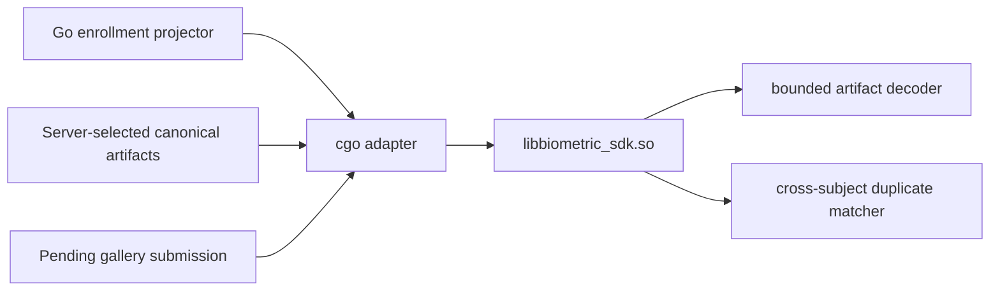
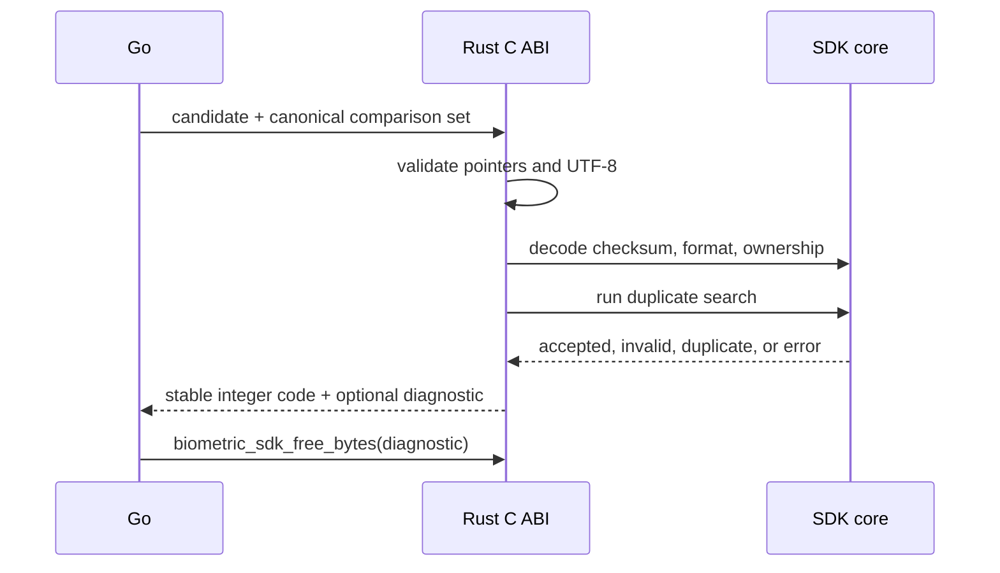

# Server FFI

## Purpose

Tanda Campus must validate enrollment artifacts with the same decoder and
duplicate policy used on devices. The `server-ffi` Cargo feature exposes that
logic through a narrow C ABI for the Go adapter. It excludes libSQL and UniFFI,
which keeps the server library smaller and avoids initializing device runtime
state.



## Build And Install

```bash
make server-lib
make install-server-lib DESTDIR=/tmp/biometric-sdk-package PREFIX=/usr/local
```

The staged package contains:

```text
/usr/local/include/biometric_sdk.h
/usr/local/lib/libbiometric_sdk.so
/usr/local/lib/pkgconfig/biometric-sdk.pc
```

Consumers use:

```bash
PKG_CONFIG_PATH=/usr/local/lib/pkgconfig pkg-config --cflags --libs biometric-sdk
```

The shared library is linked dynamically. Tanda Campus copies it into the final
container and sets the runtime library search path. Static linking is not the
supported contract because the Go libSQL driver and this SDK both contain Rust
runtime objects that can export colliding symbols.

## Call Contract

`biometric_sdk_validate_submission` borrows one candidate and zero or more
canonical existing artifacts. Each `BiometricArtifactView` contains pointer and
length pairs for payload and UTF-8 metadata. The caller owns every input buffer
until the function returns.



| Code | Meaning | Go behavior |
| ---: | --- | --- |
| `0` | Candidate accepted | Persist canonical template revision |
| `1` | Invalid or altered candidate artifact | Persist expected rejection |
| `2` | Candidate matches another subject | Persist population-duplicate rejection |
| `-1` | Bad adapter input, invalid canonical state, panic, or internal failure | Roll back and retry or alert |

Expected biometric rejection is data, not an infrastructure error. Internal
failure may return Rust-owned diagnostic bytes. The caller must release any
non-empty diagnostic exactly once with `biometric_sdk_free_bytes`.

## Safety

The exported entry point catches unwinding panics before they cross the C ABI.
It validates null pointers, non-zero lengths, UTF-8 text fields, payload bounds,
format version, extraction profile, checksum, and single-subject ownership.

The C boundary does not authenticate a caller or establish tenant scope. The Go
service resolves the server-owned gallery stream to a site, loads that site's
canonical templates, and serializes decisions before invoking the validator.
The SDK validates only the comparison set supplied by Go.

## Versioning

The function names, structure layout, and integer result codes are the ABI.
Changing any of them requires a coordinated major integration update. Template
format evolution is independent: the `sdk_format_version` field lets the
decoder reject unsupported payloads without changing C structure layout.
